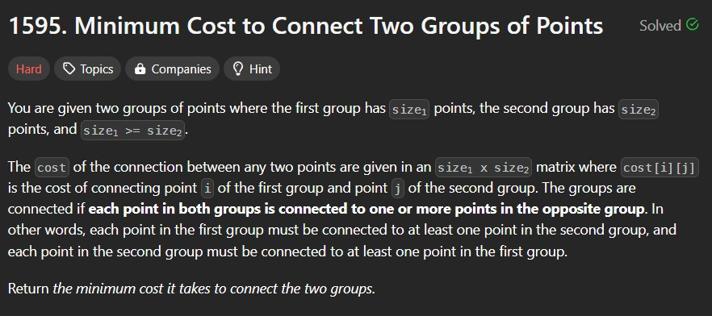
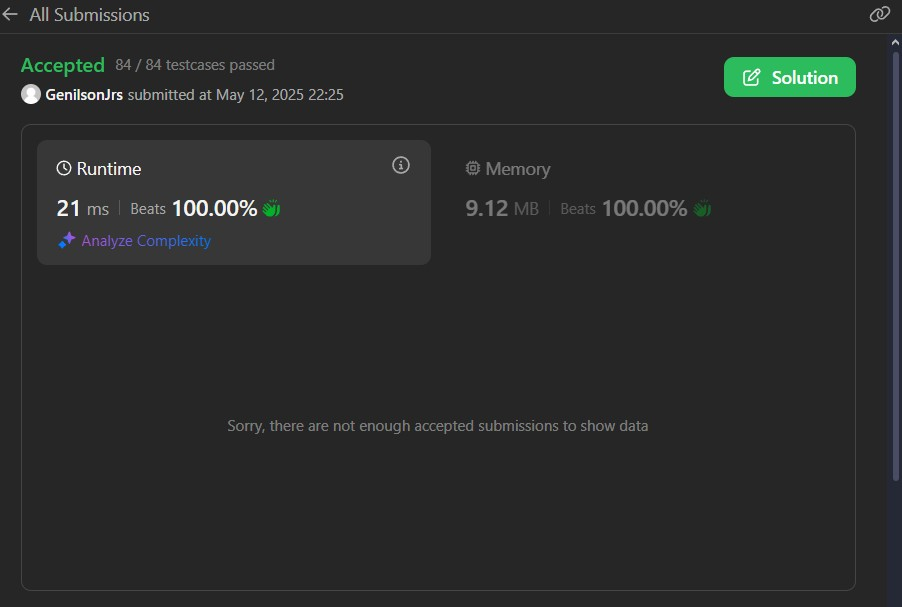
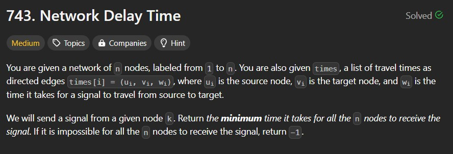
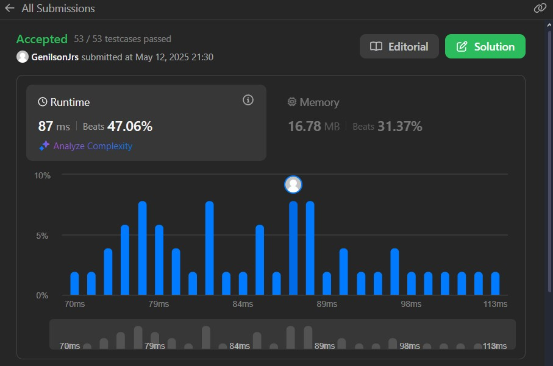
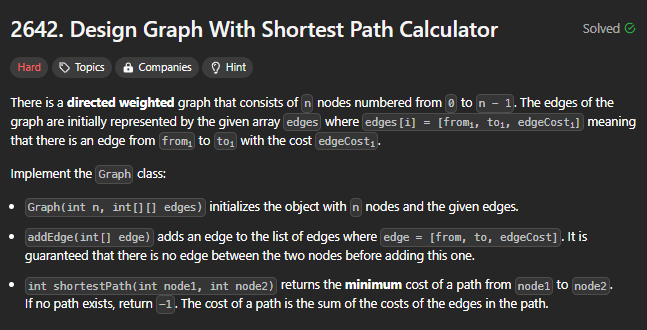
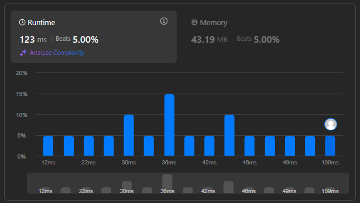
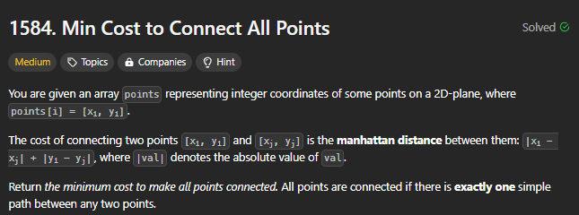
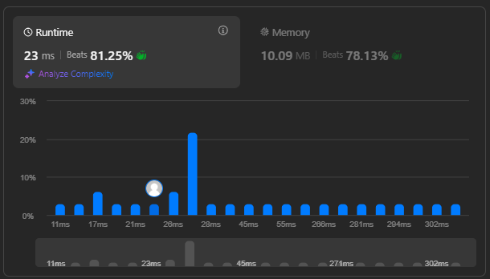

# 🔍 Resolução de Questões em Grafos 2 - LeetCode

**Número da Lista:** X

**Conteúdo da Disciplina:** Grafos 2 - DFS Numbering, Dijkstra, Prim e Kruskal.  

## 👨‍🏫 Alunos

| Matrícula   | Aluno             |
|-------------|-------------------|
| 202045482   | [Genilson Silva](https://github.com/GenilsonJrs)    |
| 222022064   | [Carlos Eduardo](https://github.com/dudupaz)    |

---

## 📋 Sobre

Este trabalho tem como objetivo implementar algoritmos fundamentais do estudo de grafos: **DFS Numbering**, **Dijkstra**, **Prim** e **Kruskal**.

Este projeto busca reforçar conceitos teóricos de grafos de maneira prática e didática.

---

## 🖼️ Screenshots

<p align="center">Figura 1 - Difícil Problem</p>

<p align="center">
  
</p>

<p align="center" style="font-size: 14px;">
  Autor: <a href="https://github.com/GenilsonJrs" target="_blank">Genilson Silva</a>
</p>

---

<p align="center">Figura 2 - Difícil Accepted</p>

<p align="center">
  
</p>

<p align="center" style="font-size: 14px;">
  Autor: <a href="https://github.com/GenilsonJrs" target="_blank">Genilson Silva</a>
</p>

<p align="center">Figura 3 - Médio Problem</p>

<p align="center">
  
</p>

<p align="center" style="font-size: 14px;">
  Autor: <a href="https://github.com/GenilsonJrs" target="_blank">Genilson Silva</a>
</p>

---

<p align="center">Figura 4 - Médio Accepted</p>

<p align="center">
  
</p>

<p align="center" style="font-size: 14px;">
  Autor: <a href="https://github.com/GenilsonJrs" target="_blank">Genilson Silva</a>
</p>

---

<p align="center">Figura 5 - Difícil Problem</p>

<p align="center">
  
</p>

<p align="center" style="font-size: 14px;">
  Autor: <a href="https://github.com/dudupaz" target="_blank">Carlos Paz</a>
</p>

---

<p align="center">Figura 6 - Difícil Accepted</p>

<p align="center">
  
</p>

<p align="center" style="font-size: 14px;">
  Autor: <a href="https://github.com/dudupaz" target="_blank">Carlos Paz</a>
</p>

<p align="center">Figura 7 - Médio Problem</p>

<p align="center">
  
</p>

<p align="center" style="font-size: 14px;">
  Autor: <a href="https://github.com/dudupaz" target="_blank">Carlos Paz</a>
</p>

---

<p align="center">Figura 8 - Médio Accepted</p>

<p align="center">
  
</p>

<p align="center" style="font-size: 14px;">
  Autor: <a href="https://github.com/dudupaz" target="_blank">Carlos Paz</a>
</p>


### 🎥 Vídeo de Apresentação

Neste vídeo, apresentamos o trabalho desenvolvido, abordando os algoritmos do conteúdo da disciplina.

[Genilson Dificil](https://www.youtube.com/watch?v=obyUrAIdvo4)

[Genilson Medio](https://www.youtube.com/watch?v=Jf2elK-1MvQ)

[Carlos Dificil](https://www.youtube.com/watch?v=m886-A7g4vA)

[Carlos Medio](https://www.youtube.com/watch?v=jNC2zmDESBk)

---

### ✅ Pré-requisitos

- Compilador C instalado (ex: GCC)
- Terminal compatível com comandos do sistema
- Sistema operacional: **Windows ou Linux**

---

## ⚙️ Instalação e Execução

**Linguagem:** C
**Framework:** Nenhum

1. **Clone o repositório:**

```bash
git clone https://github.com/projeto-de-algoritmos-2025/Grafos2_GC_Code.git
```
2. **Entre na pasta do projeto:**

```bash
cd Grafos2_GC_Code
```
3. **Compile o código (Windows ou Linux):**

---

## ▶️ Uso

Entre o LeetCode e teste o código a partir de lá. Verá a submissão e o funcionamento do algoritmo melhor.

[LeetCode](https://www.google.com/url?sa=t&rct=j&q=&esrc=s&source=web&cd=&cad=rja&uact=8&ved=2ahUKEwiawrvJsp-NAxVQDbkGHftsHnUQFnoECAsQAQ&url=https%3A%2F%2Fleetcode.com%2F&usg=AOvVaw1wTHj-6jLn7cx7306Wwc9S&opi=89978449)


## 🧠 Outros

- O algoritmo **DFS Numbering** atribui um número de descoberta e de finalização a cada vértice durante uma busca em profundidade, útil para análise de tempo e estrutura dos grafos.

- O algoritmo **Dijkstra** encontra o caminho mais curto de um vértice origem até os demais, utilizando uma fila de prioridade e custos acumulados.

- O algoritmo **Prim** constrói uma árvore geradora mínima iniciando de um vértice e expandindo pelos menores pesos conectados a vértices já visitados.

- O algoritmo **Kruskal** também encontra uma árvore geradora mínima, mas ordena todas as arestas por peso e as adiciona conforme não formem ciclos, usando união-busca (Union-Find).


